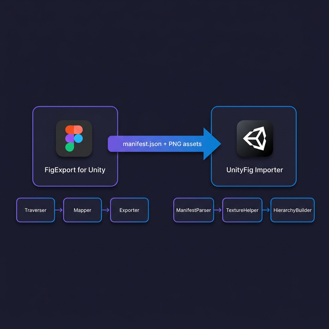
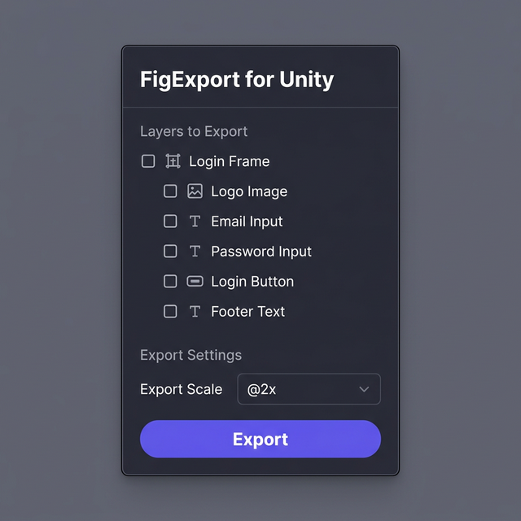
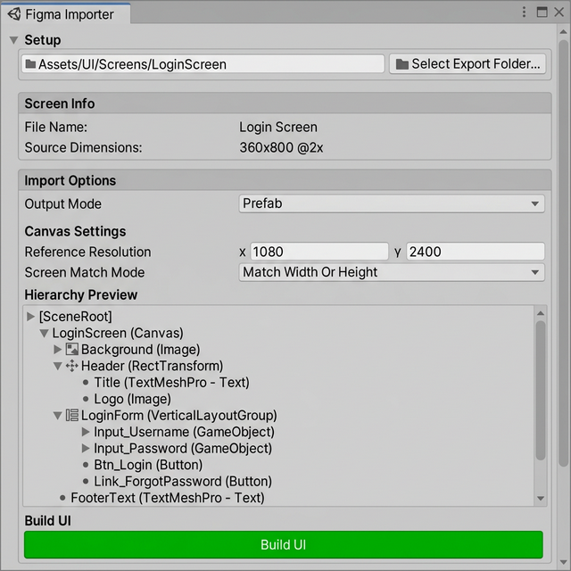

# Figma-To-Unity — Standalone Export & Import Tool

> Công cụ chuyển đổi thiết kế Figma sang Unity UI một cách tự động. Gồm 2 phần hoạt động độc lập: **Figma Plugin** (export) và **Unity Editor** (import).



---

## ✨ Tính Năng Chính

- ✅ **Export trực tiếp từ Figma** — Plugin chạy trong Figma, chọn frame → export manifest + PNG
- ✅ **Import vào Unity** — Editor Window parse manifest, tạo UI hierarchy tự động
- ✅ **Hỗ trợ UGUI & 2D Object** — Chọn render pipeline phù hợp
- ✅ **Auto Layout → Layout Groups** — Figma auto-layout chuyển sang Unity HorizontalLayoutGroup / VerticalLayoutGroup
- ✅ **TextMeshPro** — Text tự động map font, size, color, alignment
- ✅ **Per-element Merge/Exclude/PNG** — Tuỳ chỉnh từng element trong layer tree
- ✅ **Hash-based Deduplication** — Tự động loại bỏ PNG trùng lặp
- ✅ **Raycast Optimization** — Tự động disable `raycastTarget` cho decorative elements
- ✅ **Scene / Prefab / Both** — Chọn output mode linh hoạt
- ✅ **Canvas Scale Presets** — Auto-detect scale từ design size

---

## 🏗️ Kiến Trúc

```
figma-to-unity/
├── FigExport for Unity/       # Figma Plugin (TypeScript)
│   └── src/
│       ├── main.ts            # Plugin entry point
│       ├── ui.ts / ui.html    # Plugin UI (layer tree, settings)
│       ├── traverser.ts       # DFS node traversal
│       ├── mapper.ts          # Figma constraints → Unity anchors
│       ├── exporter.ts        # PNG export + manifest assembly
│       ├── naming.ts          # File naming rules
│       └── types.ts           # Type definitions
│
├── UnityFig Importer/         # Unity Editor Package (C#)
│   └── Editor/
│       ├── FigmaImporterWindow.cs  # Main EditorWindow
│       ├── ManifestParser.cs       # JSON → C# objects
│       ├── TextureImportHelper.cs  # PNG → Sprite import
│       ├── HierarchyBuilder.cs     # Build UI hierarchy
│       └── Data/
│           └── ManifestData.cs     # Data model classes
│
└── document/                  # Tài liệu kỹ thuật
    └── docs/
        ├── MANIFEST_SPEC.md   # Manifest JSON schema
        ├── ANCHOR_MAPPING.md  # Constraint → Anchor mapping
        ├── NAMING.md          # File naming conventions
        └── PLAN.md            # Development plan
```

---

## 📦 Cài Đặt

### Yêu cầu

| Component | Phiên bản |
|:---|:---|
| **Figma Desktop** | Latest |
| **Unity** | 2022.3+ LTS |
| **TextMeshPro** | Installed via Package Manager |
| **Newtonsoft JSON** | Installed via Package Manager |
| **Node.js** | >= 18 (để build plugin) |

### Bước 1: Cài đặt Figma Plugin

```bash
cd "FigExport for Unity"
npm install
npm run build
```

Trong Figma Desktop:
1. **Plugins** → **Development** → **Import plugin from manifest...**
2. Chọn file `FigExport for Unity/manifest.json`
3. Plugin sẽ xuất hiện trong menu Plugins

### Bước 2: Cài đặt Unity Importer

Có 2 cách:

**Cách 1 — Copy thư mục:**
```
Copy thư mục "UnityFig Importer" vào thư mục Assets/Packages/ trong Unity project
```

**Cách 2 — Unity Package Manager (Local):**
1. Mở **Window** → **Package Manager**
2. **"+"** → **Add package from disk...**
3. Chọn file `UnityFig Importer/package.json`

---

## 🚀 Hướng Dẫn Sử Dụng

### Step 1: Export từ Figma



1. Mở design trong Figma Desktop
2. **Chọn Frame** cần export (ví dụ: Login Screen)
3. Chạy plugin: **Plugins** → **FigExport for Unity**
4. Trong plugin UI:
   - Xem **layer tree** — bật/tắt từng element
   - Click **"Merge"** trên element để flatten với children thành 1 PNG
   - Click **"PNG"** trên TEXT element để rasterize thay vì dùng TMP
   - Click **"×"** để exclude element
   - Chọn **Export Scale** (@1x, @2x, @3x, @4x)
5. Click **"Export"** → Plugin xuất ra thư mục chứa:
   ```
   FigmaExport_LoginScreen_20260310/
   ├── manifest.json      # Metadata + UI hierarchy
   ├── bg_login.png        # Background image
   ├── btn_login.png       # Button image
   ├── icon_email.png      # Email icon
   └── ...                 # Các PNG assets khác
   ```

### Step 2: Import vào Unity



1. **Copy thư mục export** vào bất kỳ đâu trong `Assets/`
2. Mở **Window** → **Figma Importer**
3. Cấu hình:
   - **Export Folder**: Chọn thư mục chứa `manifest.json`
   - **Output Mode**: Scene / Prefab / Both
   - **Canvas Settings**: Reference Resolution, Match Width or Height
   - **Sprite Output**: Chọn thư mục lưu sprites
   - **Font Mapping**: Auto-match hoặc chọn thủ công
4. Click **"Build UI"**
5. Kết quả:
   - **Scene mode**: Canvas + UI hierarchy được tạo trong Scene
   - **Prefab mode**: Prefab được lưu vào thư mục chỉ định

---

## ⚙️ Manifest Format

Export file `manifest.json` theo schema v1.0:

```json
{
  "version": "1.0",
  "screen": {
    "name": "Login Screen",
    "figmaSize": { "w": 360, "h": 800 },
    "unityRefResolution": { "w": 720, "h": 1600 },
    "exportScale": 2
  },
  "elements": [
    {
      "id": "1:234",
      "name": "Login Button",
      "figmaType": "FRAME",
      "parentId": "1:100",
      "rect": { "x": 30, "y": 500, "w": 300, "h": 50 },
      "unity": {
        "anchorMin": [0, 0],
        "anchorMax": [1, 1],
        "pivot": [0.5, 0.5],
        "offsetMin": [30, -550],
        "offsetMax": [-30, -500]
      },
      "components": ["Image"],
      "asset": "btn_login@2x.png",
      "interactive": true
    }
  ],
  "assets": [...],
  "fonts": [...]
}
```

> Chi tiết đầy đủ: [MANIFEST_SPEC.md](document/docs/MANIFEST_SPEC.md)

---

## 🔧 Tính Năng Per-Element

| Nút | Chức năng |
|:---|:---|
| **Merge** | Flatten parent + tất cả children thành 1 PNG duy nhất |
| **PNG** (text) | Rasterize TEXT element thành PNG thay vì dùng TextMeshPro |
| **×** (exclude) | Bỏ qua element, không export |
| **👁** (visibility) | Ẩn/hiện element trong Figma preview |

---

## 📐 Constraint → Anchor Mapping

Figma constraints được tự động chuyển sang Unity RectTransform anchors:

| Figma Constraint | Unity Anchor |
|:---|:---|
| `LEFT` | anchorMin.x = 0, anchorMax.x = 0 |
| `RIGHT` | anchorMin.x = 1, anchorMax.x = 1 |
| `CENTER` | anchorMin.x = 0.5, anchorMax.x = 0.5 |
| `LEFT_RIGHT` (scale) | anchorMin.x = 0, anchorMax.x = 1 |
| `TOP` | anchorMin.y = 1, anchorMax.y = 1 |
| `BOTTOM` | anchorMin.y = 0, anchorMax.y = 0 |
| `TOP_BOTTOM` (scale) | anchorMin.y = 0, anchorMax.y = 1 |

> Chi tiết đầy đủ: [ANCHOR_MAPPING.md](document/docs/ANCHOR_MAPPING.md)

---

## 🗂️ Supported Figma Node Types

| Figma Type | Unity Output |
|:---|:---|
| **FRAME** | GameObject + RectTransform + Image (nếu có fill) |
| **TEXT** | GameObject + TextMeshProUGUI |
| **RECTANGLE** | GameObject + Image |
| **VECTOR** | PNG asset + Image |
| **BOOLEAN_OPERATION** | PNG asset + Image |
| **COMPONENT / INSTANCE** | Tương tự FRAME |
| **GROUP** | GameObject (container only) |

---

## 🎨 Build Options

| Option | Mô tả | Mặc định |
|:---|:---|:---|
| **Import Textures** | Copy + configure PNG → Sprite | ✅ On |
| **Apply 9-Slice** | Tự động set sprite border từ cornerRadius | ✅ On |
| **Disable Raycast** | Tắt raycastTarget cho decorative elements | ✅ On |
| **Scale to Resolution** | Scale positions theo reference resolution | ✅ On |

---

## 📝 Development

### Build Figma Plugin

```bash
cd "FigExport for Unity"
npm run build        # Build một lần
npm run watch        # Watch mode (auto-rebuild)
```

### Cấu trúc Plugin Build

```
FigExport for Unity/
├── dist/
│   ├── main.js      # Plugin backend (Figma sandbox)
│   └── ui.html      # Plugin UI (iframe)
└── manifest.json    # Figma plugin manifest
```

---

## 📝 License

Private — All rights reserved.
